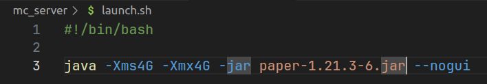
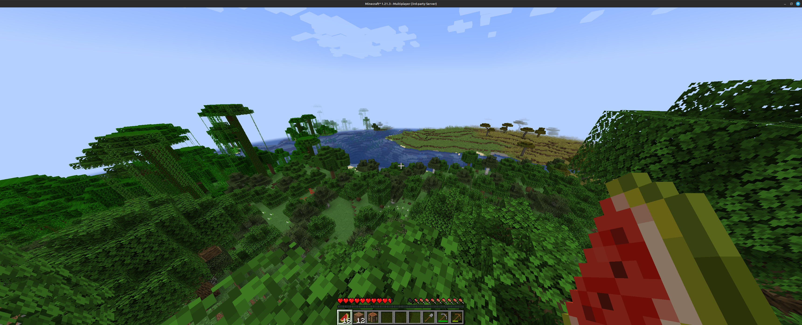
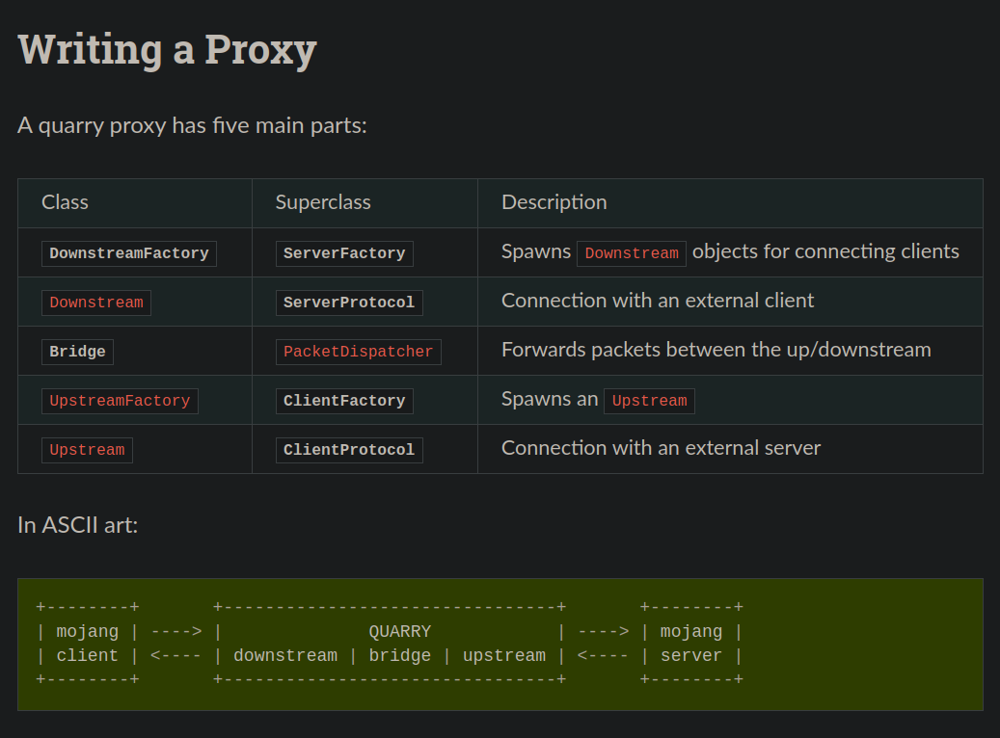
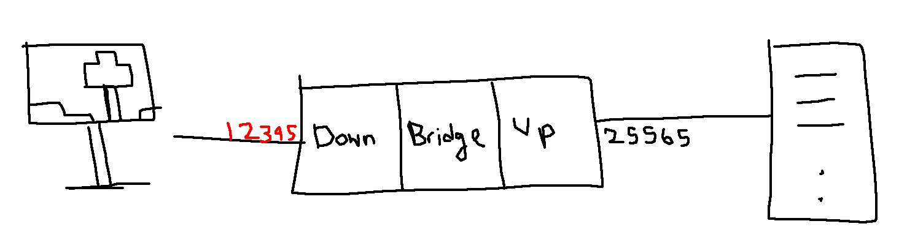
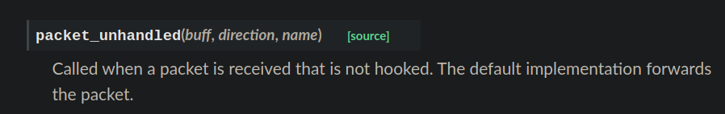
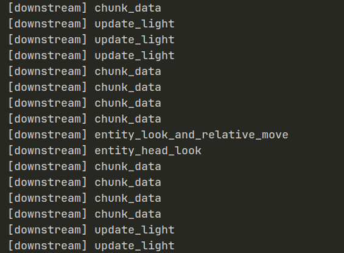

# Hacking Minecraft

Minecraft is one of the most popular games of all time because of its simplicity and flexibility. It is a sandbox game where players explore a blocky, procedurally generated 3D world. There's two gamemodes, **survival** where players collect resources, fend off monsters, and manage health and hunger and **creative** where they have unlimited resources to build freely.

Our goal in this project is to give ourselves advantage in survival mode that we would be getting creative mode. But what even is the point? In Minecraft, you can also play with other people, where their world is hosted on a server. If the world is set to survival mode, and we join their server and manage to exploit the game, we will be getting advantage over other players.

In this project, we will be looking at how we make ourselves fly, run faster, unconsumable items, greater reach etc.

# Setting up

We need

* OpenJDK 17+
* Modrinth to launch Minecraft
* PaperMC to run the server for the world



We write a quick script to launch the server with `./launch`. The server will fail to load first because we have to accept the Mojang EULA. Once we do that, we launch the server, generate the world and join on localhost at port 25565, and we're in.



Since we are running this world on a server, we can analyse the packets being sent from the client (my pc) to the server.

# Capturing client-server packets

Minecraft has a [protocol](https://wiki.vg/Protocol#Clientbound) that describes how client and server sends game data to each other. We are going to use a tool called [Quarry](https://github.com/barneygale/quarry) to write a proxy that analyses all the packets sent between the Minecraft client and server.



Usually the Mojang client and Mojang server directly communicates over a host address and a port. By default, in our `server.properties` file, the port is set to `25565` and our address is `127.0.0.1` aka. `localhost`.

But we are going to write a proxy in between to do that so that we can analyse all the packets sent.

The documentation comes with an example skeleton proxy that we will use.

```python
from twisted.internet import reactor
from quarry.net.proxy import DownstreamFactory, Bridge


class ExampleBridge(Bridge):
    pass


def main(argv):
    factory = DownstreamFactory()
    factory.bridge_class = ExampleBridge
    factory.connect_host = "127.0.0.1"
    factory.connect_port = 25566
    factory.listen("127.0.0.1", 25565)
    reactor.run()


if __name__ == "__main__":
    import sys
    main(sys.argv[1:])
```

This example creates a `DownstreamFactory` object and connects it to an example bridge. By default, it connects to port `25565`. But what we want to do is to connect the Downstream with the client on one port, and connect the Upstream to the server on another separate port.



So in `server.properties` we change `server-port=12345` and change the factory code accordingly to the diagram.

```python
factory.connect_host = "127.0.0.1"
factory.connect_port = 12345
factory.listen("127.0.0.1", 25565)
```

Now we want to modify the `Bridge` to capture the packets sent between the `Downstream` and `Upstream` and analyse it.

In the documentation, the `Bridge` class has a function called `packet_unhandled` that forwards the packets to the server by default. Using this, we can implement the logging of all the upstream and downstream packets sent.

```python
class ProxyBridge(Bridge):
    def packet_unhandled(self, buff, direction, name):
        print(f"[{direction}] {name}")
        if direction == "downstream":
            self.downstream.send_packet(name, buff.read())
        elif direction == "upstream":
            self.upstream.send_packet(name, buff.read())
```

Now we run the proxy and can see all the logged upstream and downstream packets including chunk data, and times in which I move my camera and player.



Okay we can log and analyse the packets just fine through the bridge. But can we perhaps, edit it before sending it to the server?

# Teleport Hacks

# References

* [LiveOverflow's Minecraft HACKED Series](https://www.youtube.com/playlist?list=PLhixgUqwRTjwvBI-hmbZ2rpkAl4lutnJG)
