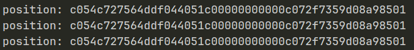
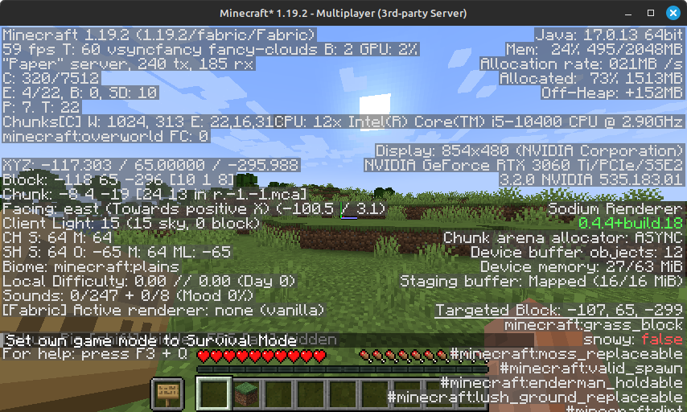
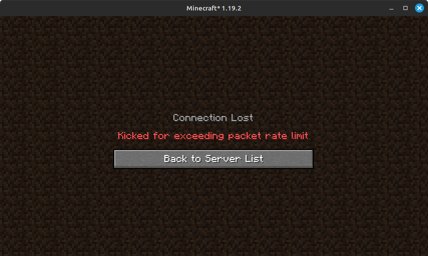
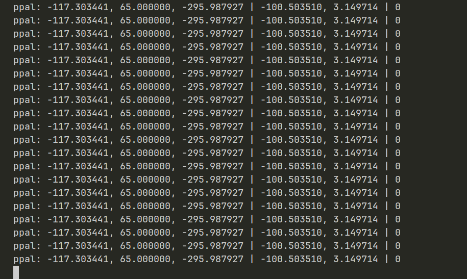
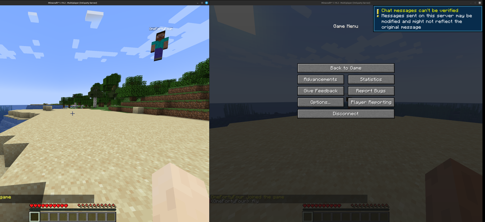
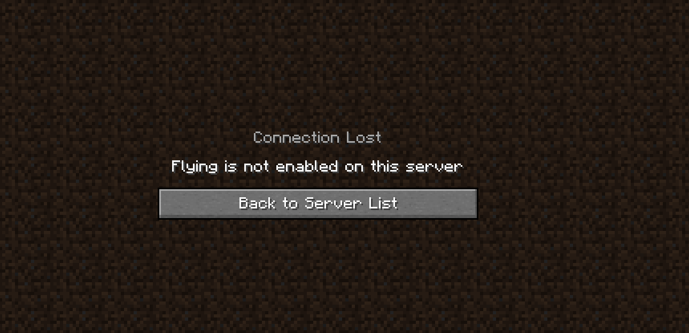

# Hacking Minecraft

#### by Zunaid Arefin - z5478318

Minecraft is one of the most popular games of all time because of its simplicity and flexibility. It is a sandbox game where players explore a blocky, procedurally generated 3D world. There's two gamemodes, **survival** where players collect resources, fend off monsters, and manage health and hunger and **creative** where they have unlimited resources to build freely.

Our goal in this project is to give ourselves advantage in survival mode that we would be getting creative mode. But what even is the point? In Minecraft, you can also play with other people, where their world is hosted on a server. If the world is set to survival mode, and we join their server and manage to exploit the game, we will be getting advantage over other players.

In this project, we will be looking at how we make ourselves fly, run faster, unconsumable items, greater reach etc.

Project source: https://github.com/SZunaidA/something-awesome

# Setting up

We need

* OpenJDK 17+
* Modrinth to launch Minecraft
* PaperMC to run the server for the world


We write a quick script to launch the server with `./launch`. The server will fail to load first because we have to accept the Mojang EULA. Once we do that, we launch the server, generate the world and join on localhost at port 25565, and we're in.


Since we are running this world on a server, we can analyse the packets being sent from the client (my pc) to the server.

# Chapter 0: Capturing client-server packets

Minecraft has a [protocol](https://wiki.vg/Protocol#Clientbound) that describes how client and server sends game data to each other. We are going to use a tool called [Quarry](https://github.com/barneygale/quarry) to write a proxy that analyses all the packets sent between the Minecraft client and server.


Usually the Mojang client and Mojang server directly communicates over a host address and a port. By default, in our `server.properties` file, the port is set to `25565` and our address is `127.0.0.1` aka. `localhost`.

But we are going to write a proxy in between to do that so that we can analyse all the packets sent.

The documentation comes with an example skeleton proxy that we will use.

```python
from twisted.internet import reactor
from quarry.net.proxy import DownstreamFactory, Bridge


class ExampleBridge(Bridge):
    pass


def main(argv):
    factory = DownstreamFactory()
    factory.bridge_class = ExampleBridge
    factory.connect_host = "127.0.0.1"
    factory.connect_port = 25566
    factory.listen("127.0.0.1", 25565)
    reactor.run()


if __name__ == "__main__":
    import sys
    main(sys.argv[1:])
```

This example creates a `DownstreamFactory` object and connects it to an example bridge. By default, it connects to port `25565`. But what we want to do is to connect the Downstream with the client on one port, and connect the Upstream to the server on another separate port.


So in `server.properties` we change `server-port=12345` and change the factory code accordingly to the diagram.

```python
factory.connect_host = "127.0.0.1"
factory.connect_port = 12345
factory.listen("127.0.0.1", 25565)
```

Now we want to modify the `Bridge` to capture the packets sent between the `Downstream` and `Upstream` and analyse it.


In the documentation, the `Bridge` class has a function called `packet_unhandled` that forwards the packets to the server by default. Using this, we can implement the logging of all the upstream and downstream packets sent.

```python
class ProxyBridge(Bridge):
    def packet_unhandled(self, buff, direction, name):
        print(f"[{direction}] {name}")
        if direction == "downstream":
            self.downstream.send_packet(name, buff.read())
        elif direction == "upstream":
            self.upstream.send_packet(name, buff.read())
```

So our bridge is now basically taking the packets, which we can do whatever with, and then after, depending on the direction (upstream or downstream), the bridge sends those packets to the client or the server accordingly.

Now we run the proxy and can see all the logged upstream and downstream packets including chunk data, and times in which I move my camera and player.


Okay we can log and analyse the packets just fine through the bridge. But can we perhaps, edit it before sending it to the server?

# Chapter 1: Teleport Hacks

In essence, if we want to teleport to a specific location, we need to update the players current location. From analysing the packets earlier, we noticed that there's an upstream packet `player_position` that we can potentially modify before sending it to the server.


According to the documentation within the library's source code here, we have to create a method called `packet_upstream_player_position` that takes in the paramters `self, buff`. When we print out the raw packet data in `buff` in hexademical, we see this:



In the Minecraft protocol documentation, we can see the `player_position` packet is structured like this.


So we can decipher the bytes and pretty print the updated player position like `player_position -302.1817816001829 / 70.0 / -3.254910089516526 | 1` which corresponds to `x / y / z | on_ground`.

Firstly, we have to find a medium where we can input where or how far we want to teleport. Normally, if a player has admin permissions on a server, they can use a chat command called `/tp x y z` to teleport to a location but normal players don't have the admin privileges. But we can still analyse chat message packets, so we can input our teleportation through there by making a method called `packet_upstream_chat_message` and checking if the raw `buff` data for our input.

### Modifying and sending the packets

Since the client is already sending the server the player position every game tick, we can just send the client our teleportation coordinates, and the client sends that to the server.


Barebones first attempt:

```python
if chat_message.startswith("tp"):
    _, x, y, z = chat_message.split(" ")
    player_postion_buf = struct.pack('>dddB', x, y, z, ground)
    self.downstream.send_packet('player_position', player_postion_buf)
```

We get an error saying there's no downstream packet called `player_postion`, which is fair because `player_position` is actually an upstream only packet. However, there's another packet called `player_position_and_look` where it is both and upstream and downstream packet. `player_position_and_look` contains more information like pitch, yaw, teleportation id, flags, dismount status. We will just intercept the `player_position_and_look` using a `packet_upstream_player_look` method and get those information to send to the client.

Second attempt:

```python
if chat_message.startswith("tp"):
    _, dx, dy, dz = chat_message.split(" ")
    x, y, z = self.orig_pos
    x += float(dx)
    y += float(dy)
    z += float(dz)

    yaw, pitch, ground = self.orig_look
    flags, teleport, dismount = 0

    player_postion_buf = struct.pack('>dddffBBB', x, y, z, yaw, pitch, flags, teleport, dismount)
    self.downstream.send_packet('player_position', player_postion_buf)
```

We also changed it so that we don't have to input the exact coordinates but input how much we want to move in x, y and z.

Demo:


It worked! We moved 5 blocks in the x axis.


But when we want to teleport really far, the server stops us because we are moving too quickly. Can we bypass this?

# Attempt at investigating a bypass for teleport


Ender pearl is an item you can throw and where ever it lands, it will teleport you to that location. **Can we potentially mimic this behavior?** How come the server doesn't think the player moved too fast when using an Ender Pearl?


When we throw an ender pearl, we can see that the server receives a `use_item`, `animation` and `teleport_confirm` packet.

Upon further investigation, we find that each teleport actually has an ID tied to it and is transferred through the `teleport_confirm` packet.


It states that its an "ID given by the Synchrnoze Player Position packet", which is the `player_position_and_look` packet we were looking at earlier. Then I realised that teleporting through our TP (teleport) also sends a `teleport_confirm` packet.

I initially hypothesised that the teleport IDs for ender pearls were different to the teleport IDs of my TP hack, but the whole world shares a single teleport ID amongst everything. It did not bypass "Player moved too quickly".

Then I checked out the `used_item` packet.


But this packet doesn't contain any information on *what* the player is holding. So we can't fake holding an Ender Pearl and then doing our TP hack tricking the server into thinking we are using an Ender Pearl.

# Chapter 2: Flying

To fly in creative mode, we press space to float up. And when we stop pressing space, we would stop floating and come to a standstill in the air. To go down, we have to do the crouch action.

In order to fly in survival mode, every time we press space, we add a constant value to our player position's y-coordinate.

In our previous teleportation hack, we sent the modified player position data to the client first, which is then forwarded to the server by the client. This time, we essentially have to do the same thing but constantly every time the user presses the space key.

### Issues with detecting keypress

Our proxy is just merely just intercepting the packets and modifying it on the fly before sending it to the server. However, these packets don't specifically tell us when the client is actually pressing the space button.

My initial idea was to detect the keypress in our proxy, but after some thought that doesn't make any sense because clients aren't the ones running the proxy! In this case I am the client and also running the proxy for testing purposes. But if I were to sniff packets sent by some other player, I wouldn't be able to detect their keypresses through the proxy.

**Solution:** We implement chat commands that starts or stops flying. In this case, we implement `.fly` and `.stopfly` to start and stop flying.

We define a class attribute `y_const`, and it is added to the y-coordinate of the player position to make them float. Then we create a `packet_upstream_chat_message` method and implement the following:

```python
if chat_message.startswith(".fly"):
    self.y_const = 5

if chat_message.startswith(".stopfly"):
    self.y_const = 0
```

So when we want to fly, it will add `5` as constant otherwise `0` so we won't fly.

### Modifying and sending the packets

Now we want to modify the packets, send it back to the client through the downstream, and then the client will send it back to the server.

#### Attempt 1

Since we want to send player position downstream and upstream, let's use `player_position_and_look` packet to do our job because it is both an upstream and downstream packet.

```python
def packet_upstream_player_position_and_look(self, buff):
    buf = buff.read()
    x, y, z, yaw, pitch, ground = struct.unpack('>dddffB', buf)

    y += self.y_const

    d_buf = struct.pack('>dddffBBB', x, y, z, yaw, pitch, 0, 0, ground)
    self.downstream.send_packet('player_position_and_look', d_buf)
    buf = struct.pack('>dddffB', x, y, z, yaw, pitch, ground)
    self.upstream.send_packet('player_position_and_look', buf)
```

The player is stuck!







From the looks of it, the method is sending the same `player_position_and_look` packet to the server really fast to the point we get kicked out for rate limiting our own server.

What I am hypothesising is that since this is the `packet_upstream_player_position_and_look` packet, which gets called everything that packet is sent, each time it sends the packet downstream aka. the client, it sends it back upstream, and repeat the whole process of sending the packet downstream to upstream again, creating this "recursive" loop.

#### Attempt 2

So this time, let's try to capture each of the packets separetely. We'll be creating

* `packet_downstream_player_position_and_look`
* `packet_upstream_player_position`

These two methods will take both type of player position packets, add `y_const` to the player's y-coordinate and send it to the server. 



In this image, it can be seen that the first client on the right used to .fly command to float up which can be seen through the client on the left because the second client on the left is receiving the information from the server. 



However, this is circumvented by the server after a while. 

Another problem is that this attempt still does not fix the issue of the first client not flying up on client side. We still need to send the new y-coordinate to the downstream client everytime our bridge sends the new y-coordiante to the upstream server. But we learnt that from the first attempt that its simply not possible because the bridge will send the same player position back and forth creating a "loop", resulting in the player being stuck.

### Fly hack verdict

Because of this, a fly hack by intercepting the packets is simply not possible just because of the restriction of having to send the position back to the client. 

# Reflection

### Teleport Hacks

If I were to attempt to investigate TP hacks further to bypass the "Player moved too quickly check", I would have a look at the PaperMC server source code to see the conditions that checks whether or not to let the Player teleport. After analysing the conditions, I would investigate how to break the conditions so that they pass without the using of the admin teleport command or Ender Pearls. However I may not be able to do this within server-client protocol, and might have to dig further into the client side code as well.

### Fly Hacks

To achieve fly hacks, I would attempt to modify the actual client instead of intercepting and modifying the packets. Because with a client that already sends malicious packets to the server, we don't have to worry about sending matching modified packets to both the server and client. 

### Overall

Overall, I have developed my approach to solving problems and learnt a lot about how communication is done over the network. I personally think my approach to tackling problems is unique and allowed me to use the security mindset. My approach was that I form a hypothesis, deeply analyse and experiment and check if my hypothesis is correct or not, which is how I make a lot of progress and learn about the internals.  

# References

* [LiveOverflow's Minecraft HACKED Series](https://www.youtube.com/playlist?list=PLhixgUqwRTjwvBI-hmbZ2rpkAl4lutnJG)
